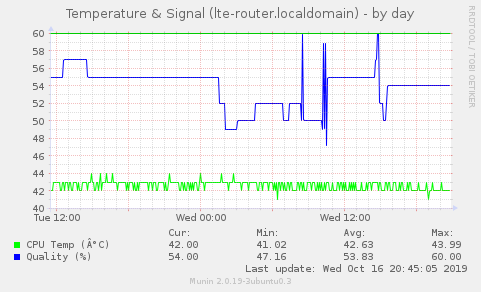

# Qualcomm LTE
Get my LTE Modem working in a low footprint environment.
I choose an Orange Pi Zero as the mainboard.
I disabled some unneeded component like wifi by blacklisting module before the kernel loads it.
System is Armbian. So most of this guide should be working on all debian variants.

## 1. Hardware
The main problem was to use this modem which is a Qualcomm MDM9200, but is an OEM modem and is not recognized by Linux Kernel module.

If you are in the same situation, lsusb and usb-devices commands are your friend, then the thing is to bind the correct driver to the right device :

```
# rc.local LTE Modem Custom
#
modprobe qmi_wwan
echo "0408 ea24" > /sys/bus/usb/drivers/qmi_wwan/new_id
echo "3-1:1.2" > /sys/bus/usb/drivers/qmi_wwan/unbind
echo "3-1:1.3" > /sys/bus/usb/drivers/qmi_wwan/unbind
echo "3-1:1.3" > /sys/bus/usb/drivers/qmi_wwan/bind
#
modprobe option
echo "0408 ea24" > /sys/bus/usb-serial/drivers/option1/new_id
#
```

1) Load the driver QMI
2) Say to the Linux module to load this driver against this particular device identified by its VID/PID
3) Because the linux driver does not load correctly for this device and subdevices 0-3. Lets unbind sub 2 and 3
4) Just bind device 3 which is the right one who has to get qmi_wwan capabilities
5) Load option driver
6) Bind option driver to the device, it will fill up all remaining subdevice, which is correct.

It will give the following result :

```
[   26.360930] usbcore: registered new interface driver cdc_wdm
[   26.375129] usbcore: registered new interface driver qmi_wwan
[   26.379096] qmi_wwan: probe of 3-1:1.0 failed with error -22
[   26.381149] qmi_wwan: probe of 3-1:1.1 failed with error -22
[   26.383477] qmi_wwan 3-1:1.2: cdc-wdm0: USB WDM device
[   26.384573] qmi_wwan 3-1:1.2 wwan0: register 'qmi_wwan' at usb-1c1b000.usb-1, WWAN/QMI device, ea:74:09:b8:f6:26
[   26.389879] qmi_wwan 3-1:1.3: cdc-wdm1: USB WDM device
[   26.391286] qmi_wwan 3-1:1.3 wwan1: register 'qmi_wwan' at usb-1c1b000.usb-1, WWAN/QMI device, ea:74:09:b8:f6:26
[   26.394398] qmi_wwan 3-1:1.2 wwan0: unregister 'qmi_wwan' usb-1c1b000.usb-1, WWAN/QMI device
[   26.417865] qmi_wwan 3-1:1.3 wwan1: unregister 'qmi_wwan' usb-1c1b000.usb-1, WWAN/QMI device
[   26.468041] qmi_wwan 3-1:1.3: cdc-wdm0: USB WDM device
[   26.469233] qmi_wwan 3-1:1.3 wwan0: register 'qmi_wwan' at usb-1c1b000.usb-1, WWAN/QMI device, ea:74:09:b8:f6:26
[   26.487117] usbcore: registered new interface driver usbserial_generic
[   26.487204] usbserial: USB Serial support registered for generic
[   26.510503] usbcore: registered new interface driver option
[   26.510585] usbserial: USB Serial support registered for GSM modem (1-port)
[   26.519928] option 3-1:1.0: GSM modem (1-port) converter detected
[   26.523713] usb 3-1: GSM modem (1-port) converter now attached to ttyUSB0
[   26.524219] option 3-1:1.1: GSM modem (1-port) converter detected
[   26.529936] usb 3-1: GSM modem (1-port) converter now attached to ttyUSB1
[   26.530406] option 3-1:1.2: GSM modem (1-port) converter detected
[   26.531751] usb 3-1: GSM modem (1-port) converter now attached to ttyUSB2'
```

Some QMI Cli command to help check the modem status :
```
qmicli --device=/dev/cdc-wdm0 --device-open-proxy --dms-get-ids
qmicli --device=/dev/cdc-wdm0 --device-open-proxy --dms-get-revision
qmicli --device=/dev/cdc-wdm0 --device-open-proxy --dms-get-model
qmicli --device=/dev/cdc-wdm0 --device-open-proxy --dms-get-manufacturer
qmicli --device=/dev/cdc-wdm0 --device-open-proxy --get-wwan-iface
qmicli --device=/dev/cdc-wdm0 --get-expected-data-format
qmicli --device=/dev/cdc-wdm0 --device-open-proxy --wda-get-data-format
qmicli --device=/dev/cdc-wdm0 --device-open-proxy --dms-get-operating-mode
#
qmicli --device=/dev/cdc-wdm0 --device-open-proxy --nas-get-signal-strength
qmicli --device=/dev/cdc-wdm0 --device-open-proxy --nas-get-signal-info
qmicli --device=/dev/cdc-wdm0 --device-open-proxy --nas-get-home-network
#
qmicli --device=/dev/cdc-wdm0 --device-open-proxy --dms-uim-verify-pin=PIN,0000
qmicli --device=/dev/cdc-wdm0 --device-open-proxy --uim-get-card-status
qmicli --device=/dev/cdc-wdm0 --device-open-proxy --nas-get-system-selection-preference
qmicli --device=/dev/cdc-wdm0 --device-open-proxy --dms-uim-set-pin-protection=PIN,enable,0000
```

If all, or most of all are working then the modem is recognized as it should and we can go further :
```
mmcli -L      # List recognized modem
mmcli -m 0    # Give detailed information about modem index 0
```
The lines above to check if the modem is corectly seen by the system.

If OK, just play around the NetworkManager to create a new connection profile. It should be easy as the modem is correctly detected.

```
nmcli connection edit type gsm con-name "My GPRS Connection"
nmcli> print
nmcli> set connection.interface-name cdc-wdm0                   # "Primary Port" when doing mmcli -m 0 
nmcli> set gsm.pin 0000
nmcli> set connection.autoconnect yes
nmcli> set gsm.apn bestone.com
```

The connection is now created ans in autoconnect mode so it should already be is state connected :
```
nmcli conn show                                   # Display connection status
nmcli conn up "My GPRS Connection"                # Activate connection (if not autoconnect mode)
nmcli conn down "My GPRS Connection"              # Disable connection
```
```
mmcli -b 0    # Give detailed information about bearer index 0 (Ip information, LTE network, etc...)
```


## 2. Software, Security and Routing
Then, as my project is to make this modem working on a small OrangePi zero, and to connect it to my home network I will add a part of well known IP forwarding and IPTables.

sysctl.conf
```
net.ipv4.ip_forward= 1                            # Enable Forwarding
vm.swappiness= 0                                  # Do not use swap as HDD is a flash
net.ipv6.conf.all.disable_ipv6 = 1                # Disable IPV6
net.ipv6.conf.all.autoconf = 0                    # Disable IPV6
net.ipv6.conf.default.disable_ipv6 = 1            # Disable IPV6
net.ipv6.conf.default.autoconf = 0                # Disable IPV6
```

Use iptables-persistent set of script to run it smoothly

iptables IPV4 ruleset
```
# Generated by iptables-save v1.6.1 on Mon Aug 26 15:54:35 2019
*filter
:INPUT DROP [0:0]
:FORWARD DROP [0:0]
:OUTPUT DROP [0:0]
-A INPUT -i wwan0 -p udp -m udp --sport 67:68 --dport 67:68 -j ACCEPT
-A INPUT -i lo -j ACCEPT
-A INPUT -m state --state RELATED,ESTABLISHED -j ACCEPT
-A INPUT -p icmp -m icmp --icmp-type 8 -j ACCEPT
-A INPUT -s 192.168.0.0/23 -i eth0 -p tcp -m state --state NEW -m tcp --dport 22 -j ACCEPT
-A INPUT -s 192.168.254.0/24 -i eth0 -p tcp -m state --state NEW -m tcp --dport 22 -j ACCEPT
-A INPUT -s 192.168.0.0/24 -i eth0 -p udp -m udp --dport 161 -j ACCEPT
-A INPUT -i eth0 -p ospf -j ACCEPT
-A FORWARD -i eth0 -j ACCEPT
-A FORWARD -o eth0 -j ACCEPT
-A OUTPUT -o wwan0 -p udp -m udp --sport 67:68 --dport 67:68 -j ACCEPT
-A OUTPUT -o lo -j ACCEPT
-A OUTPUT -m state --state RELATED,ESTABLISHED -j ACCEPT
-A OUTPUT -p icmp -m icmp --icmp-type 8 -j ACCEPT
-A OUTPUT -p udp -m udp --dport 53 -j ACCEPT
-A OUTPUT -p udp -m udp --dport 123 -j ACCEPT
-A OUTPUT -p tcp -m state --state NEW -m tcp --dport 80 -j ACCEPT
-A OUTPUT -p tcp -m state --state NEW -m tcp --dport 443 -j ACCEPT
-A OUTPUT -o eth0 -p ospf -j ACCEPT
COMMIT
# Completed on Mon Aug 26 15:54:35 2019
# Generated by iptables-save v1.6.1 on Mon Aug 26 15:54:35 2019
*nat
:PREROUTING ACCEPT [12370:1767027]
:INPUT ACCEPT [10:626]
:OUTPUT ACCEPT [1170:138534]
:POSTROUTING ACCEPT [954:72909]
-A POSTROUTING -o wwan0 -j MASQUERADE
COMMIT
# Completed on Mon Aug 26 15:54:35 2019
```

iptables IPV6 is dropping all. Will see IPV6 later.
```
# Generated by ip6tables-save v1.6.1 on Sat Jul 20 12:12:17 2019
*filter
:INPUT DROP [0:0]
:FORWARD DROP [0:0]
:OUTPUT DROP [482:23328]
COMMIT
# Completed on Sat Jul 20 12:12:17 2019
```


## 3. Monitoring system and LTE

SNMP Daemon
Install SNMP daemon
Then modify /etc/snmp/snmpd.conf
```
agentAddress udp:161                        # to listen to the world
rocommunity secret  10.0.0.0/16             # to only answer to your network or station

# add extend script to monitor some specific values (detailscoming after)
extend  opi_temp      		/usr/local/bin/opi-temp.sh internal
extend  opi_lte_quality		/usr/local/bin/opi-signal.sh signal
```
The rest can be left default or adapted to your needs.


- Connectivity
I'm using munin to monitor the device through SNMP.
Use this command to discover most of SNMP sensors :
 ```
 munin-node-configure --shell --snmp <host|cidr> --snmpversion <ver> --snmpcommunity <comm>
 ```
 Then cut/paste the adviced `ln` commands.
 Most will work, CPU, MEM, eth0 traffic/errors


- Temperature and Radio status
On the device temperature is not reported in the SNMP MIB. So I did a little script to get the temperature.
This the file : `/usr/local/bin/opi-temp.sh`

Also the quality of LTE signal can be monitored this way, with the file : `/usr/local/bin/opi-signal.sh`


With the extend keywork in snmpd.conf file, the values will be exposed through SNMP. The following will help to find the OIDs.

```
snmpwalk -v2c -c <comm> <IP> .1.3.6.1.4.1.8072.1.3.2.3.1.2
```


Then I had to create a specific plugin for Munin to poll for these new OIDs. The file should be placed here :
`/usr/share/munin/plugins/snmp__opi_extend`
Then `ln` it as a usual plugin.
And there we are !





## 4. BIRD
The second part of the project is to add BIRD and use OSPF protocol to advertise the default gateway and use this LTE Internet connection as a backup to my FTTH connection.

add this to bird.conf should do the trick :

```
router id 192.168.254.14;

protocol device {
        scan time 10;
}

protocol kernel {
	import all;
        export all;
        scan time 15;
	learn;
}


protocol ospf {
        import all;
	export all;
        area 0 {
                interface "eth0" {
                        cost 1000;
                        type pointopoint;
                        hello 10; retransmit 2; wait 10; dead 40;
                };

        };
}
```

I will add ospf passphrase security :
